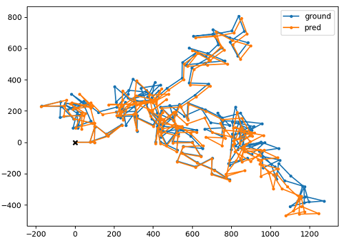

# Extended Kalman Filter in JAX
Extended Kalman Filter(EKF) code written in Python using JAX library. JAX is essentially JAX with autodiff. For EKF, JAX is especially useful for calculating jacobian through `jax.numpy.jacfwd`. There is also a EKF code written with Numpy instead of JAX, where jacobian matrix has to calculated by hand and then be explicitly given as argument in the code.

## Dependencies
- jax 0.3.14
- matplotlib 3.5.3
- tqdm
- numpy (for numpy version of EKF)
## Mechanism of Extended Kalman Filter
The extended Kalman filter (EKF) is a widely used algorithm for estimating the state of a dynamic system when the system and measurement models are non-linear. It allows for the incorporation of non-linear models into the Kalman filter framework by linearizing the models around the current estimate of the state.

Consider a non-linear system model of the form:

$$ x_k = f(x_{k-1}) + w_{k-1} $$

where $f(\cdot)$ is a non-linear function. In order to use the Kalman filter, we must linearize this model around the current estimate of the state, $\hat{x}_{k-1}$. This linearized model is given by:

$$ x_k \approx A\hat{x}_{k-1} + w_{k-1} $$

where $A$ is the Jacobian of the non-linear function $f(\cdot)$ evaluated at the current estimate of the state:

$$ A = \frac{\partial f}{\partial x}(\hat{x}_{k-1}) $$

Similarly, consider a non-linear measurement model of the form:

$$ y_k = h(x_k) + v_k $$

where $h(\cdot)$ is a non-linear function. In order to use the Kalman filter, we must linearize this model around the current estimate of the state, $\hat{x}_k$. This linearized model is given by:

$$ y_k \approx H\hat{x}_k + v_k $$

where $H$ is the Jacobian of the non-linear function $h(\cdot)$ evaluated at the current estimate of the state:

$$ H = \frac{\partial h}{\partial x}(\hat{x}_k) $$

With these linearized models, we can proceed with the Kalman filter as usual, using the prediction and correction steps described below.

At each time step, the EKF proceeds through the following steps:

1. **Prediction step**: The EKF predicts the state of the system at the current time step based on the previous state and the linearized system model. This prediction is given by:

$$ \hat{x}_k = A\hat{x}_{k-1} $$

where $A$ is the linearized state transition matrix and $\hat{x}_{k-1}$ is the current estimate of the state.

2. **Correction step**: The EKF then updates the predicted state based on the measurement of the system state at the current time step. The updated estimate is given by:

$$ \hat{x}_k = \hat{x}_k + K_k(y_k - H\hat{x}_k) $$

where $K_k$ is the Kalman gain at time step $k$, which is given by:

$$ K_k = P_kH^T(HP_kH^T + R)^{-1} $$

and $P_k$ is the state covariance matrix at time step $k$, which is given by:

$$ P_k = AP_{k-1}A^T + Q $$

Here, $y_k$ is the measurement of the system state at time step $k$, $H$ is the linearized measurement matrix, $Q$ is the process noise covariance matrix, and $R$ is the measurement noise covariance matrix.

One important consideration when using the extended Kalman filter is the choice of the process and measurement noise covariances, $Q$ and $R$. In the linear Kalman filter, these covariances can be chosen based on the knowledge of the noise characteristics of the system and measurements. However, in the non-linear case, the choice of these covariances can have a significant impact on the performance of the EKF. In general, it is recommended to choose these covariances based on the uncertainty in the linearized models, rather than the uncertainty in the true non-linear models.
